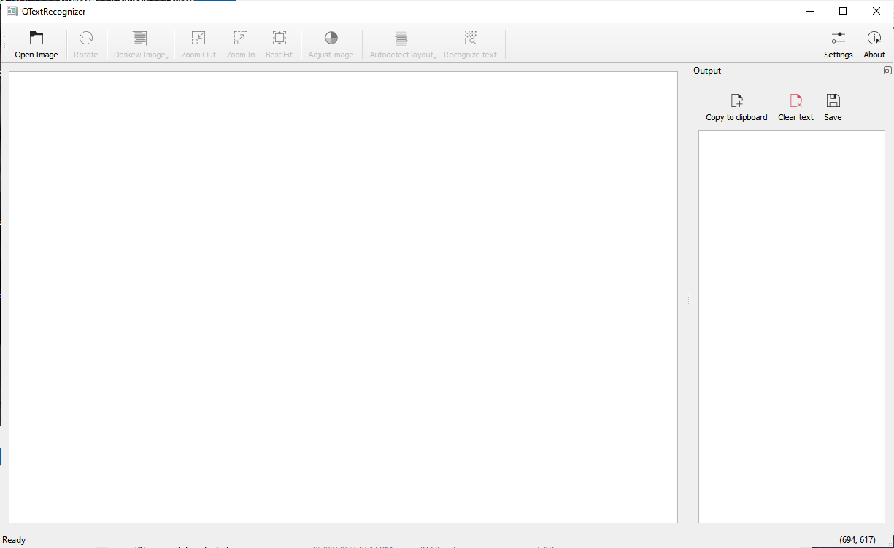
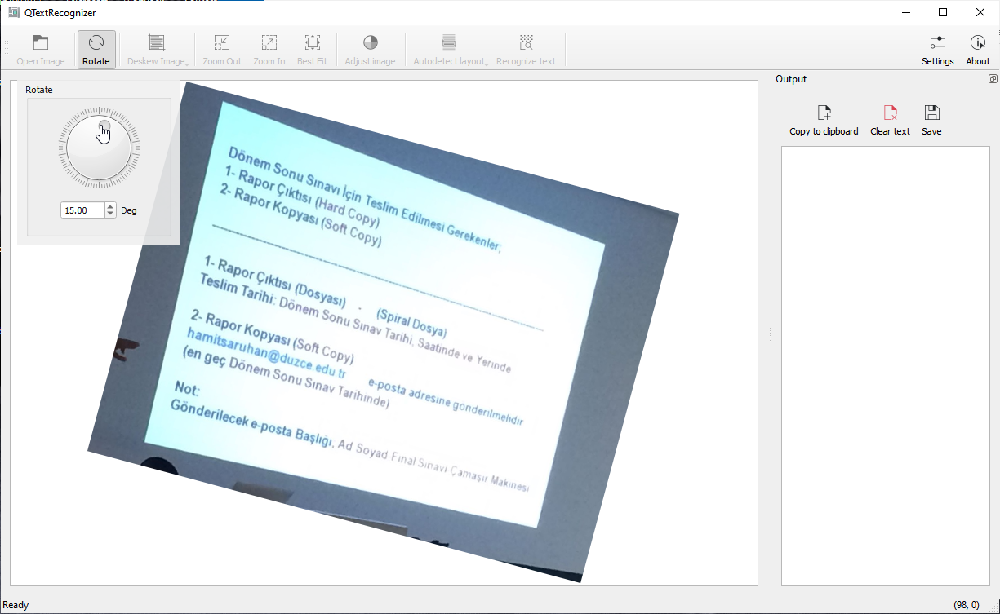
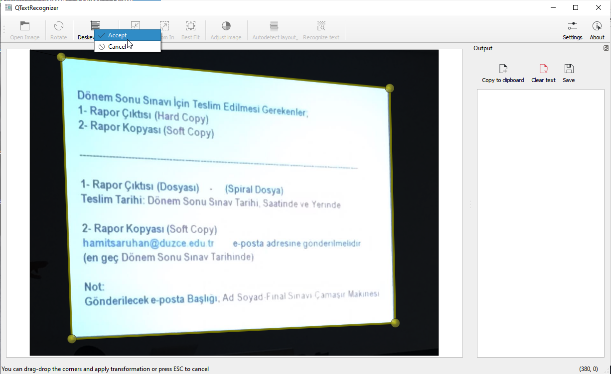
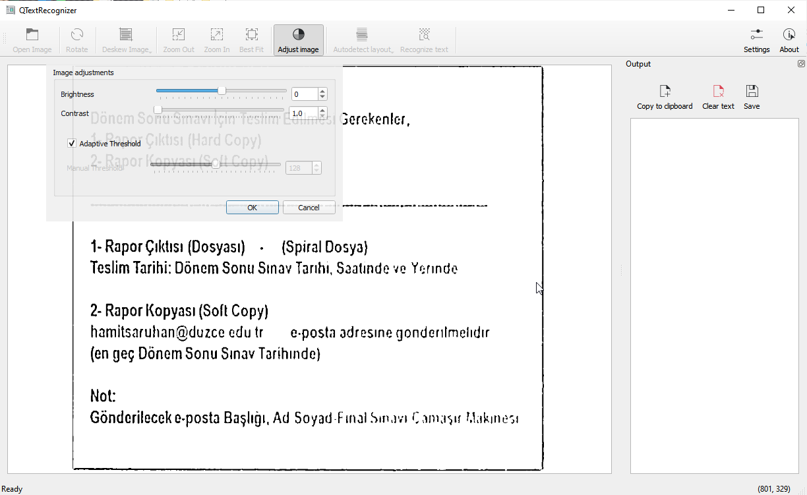
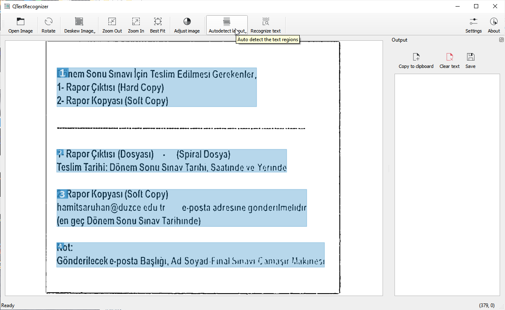
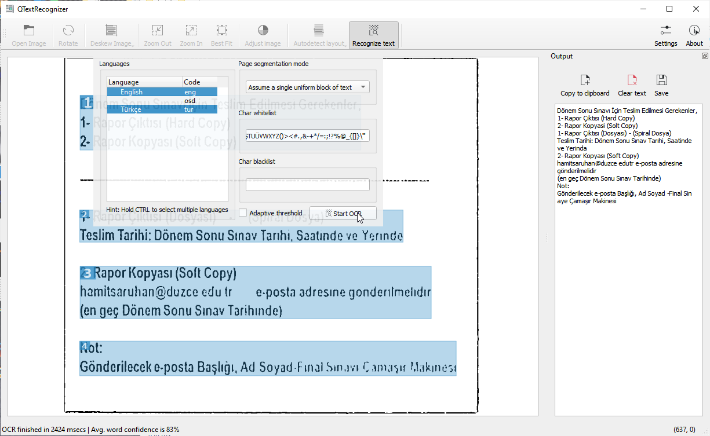
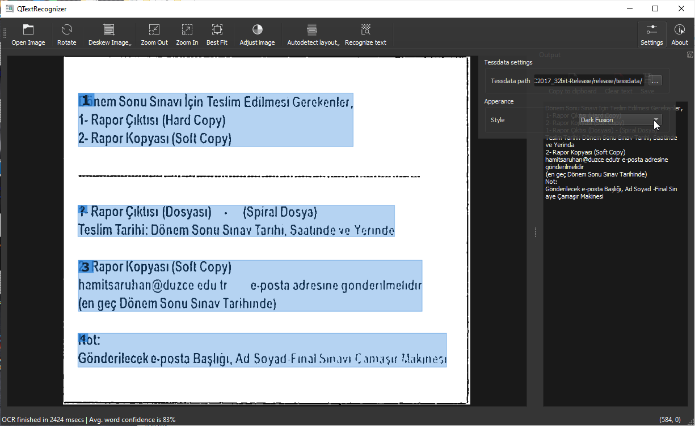

# QTextRecognizer
A gui for tesseractOCR with some preprocessing image options with OpenCV for better recognize text from images

[Download latest version (for Windows (vc15_x86))](https://github.com/mguludag/QTextRecognizer/releases/download/1.0.3/qtextrecognizer_vc15_x86.7z) 

#### Additional downloads

* You have to download languages from tesseract-ocr tessdata github page.

## How to use?

* Open the app, drag and drop picture or use open button.
* Apply the preprocess options you want:
  * Rotate
  * Remove warp
  * Threshold
  * Brightness, contrast
* Select the text blocks by mouse also press **SHIFT** key for select multiple text blocks.
* Press Recognize text button and adjust the options you want:
  * Select language(s)
  * Select Page segmentation mode
  * Insert black/white list for characters you want
  * Select adaptive threshold before recognition you want
  * Press Start OCR and wait for the result

## Screenshots

## Building

#### Dependencies

* Qt 5.x and Qt Creator
* OpenCV 4.x
* Tesseract 4.1
* Leptonica
